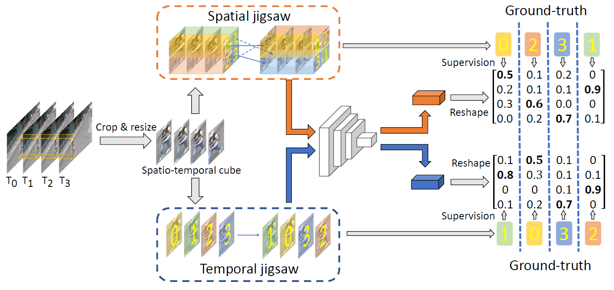

# Jigsaw-VAD
Official pytorch implementation for the paper entitled "[Video Anomaly Detection by Solving Decoupled Spatio-Temporal Jigsaw Puzzles](https://arxiv.org/abs/2207.10172)" (ECCV 2022)



# Environments
- python 3.7.10
- pytorch 1.7.1
- torchvision 0.8.2
- scipy 1.7.1
- opencv-python 4.5.4.58
- pillow 8.2.0


# Data Preparation
Please make sure that you have sufficient storage.
```
python gen_patches.py --dataset shanghaitech --phase test --filter_ratio 0.8 --sample_num 9
```

|    Dataset    | # Patch (train) |  # Patch (test) |  filter ratio  |  sample num  |  storage  |
|:-------------:|:---------------:|:---------------:|:--------------:|:------------:|:---------:|
|      Ped2     |       27660     |       31925     |       0.5      |       7      |     20G   |
|     Avenue    |       96000     |       79988     |       0.8      |       7      |     58G   |
|  Shanghaitech |      145766     |      130361     |       0.8      |       9      |    119G   |


# Training
```
python main.py --dataset shanghaitech --val_step 100 --print_interval 20 --batch_size 192 --sample_num 9 --epochs 100 --static_threshold 0.2
```


# Testing
```
python main.py --dataset shanghaitech/avenue/ped --sample_num 9/7/7 --checkpoint xxx.pth
```
We provide the pre-trained weights for [STC](https://drive.google.com/file/d/1-ZjTHnadKwb6vagrIE0SUHGalLu0gmfs/view?usp=sharing), [Avenue](https://drive.google.com/file/d/17qUCgzmFt6DwE1M78GcrxtYkM1K0zser/view?usp=share_link) and [Ped2](https://drive.google.com/file/d/16qHhS8-srFcQTgo6M1266GAfVrW-RP3e/view?usp=share_link).


# Citation
```
@inproceedings{wang2022jigsaw-vad,
  title     = {Video Anomaly Detection by Solving Decoupled Spatio-Temporal Jigsaw Puzzles},
  author    = {Guodong Wang and Yunhong Wang and Jie Qin and Dongming Zhang and Xiuguo Bao and Di Huang},
  booktitle = {European Conference on Computer Vision (ECCV)},
  year      = {2022}
}
```
